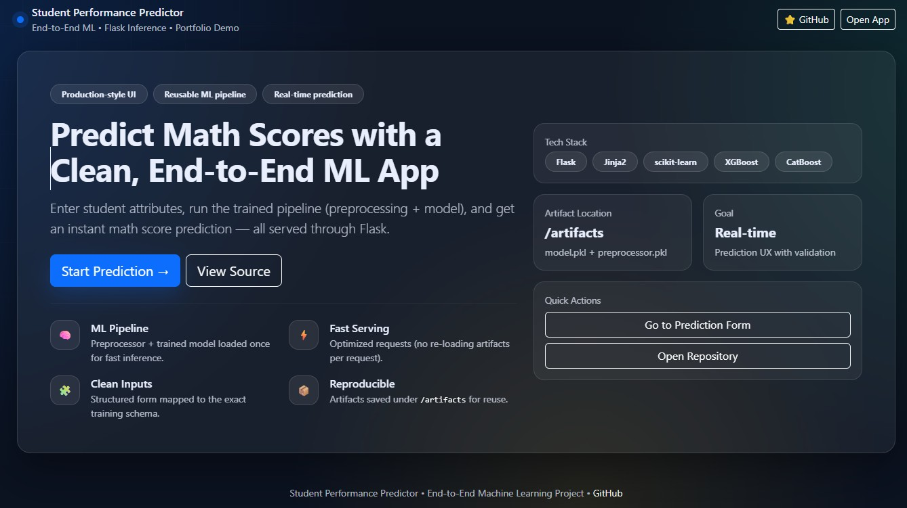
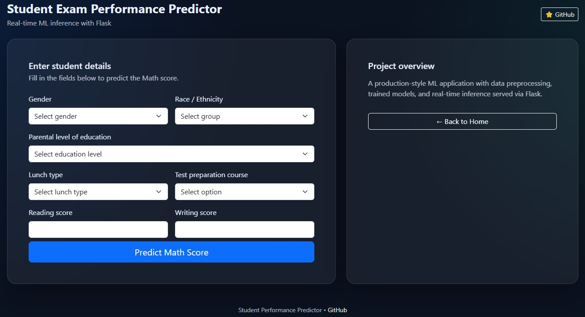

  

<h1 align="center">Student Performance Predictor</h1>

  <b>End-to-End Machine Learning Application with Flask Inference and Production-Style UI</b>

  
  
  
  

---

## 🚀 Project Overview

**Student Performance Predictor** is a complete **end-to-end Machine Learning application** that predicts a student’s **Math score** based on demographic and academic attributes.

It demonstrates how a trained ML pipeline (**preprocessing + model**) can be **served in real time** through a **single Flask-based web application**, following **production-oriented MLOps practices** (modular pipelines, artifacts, and reusable inference).

---

## ✨ Application Preview

### Prediction Form

  

The **Prediction Result** section displays the final value returned by the ML model and is rendered back to the UI.

---

## 🎯 What I Built in This Project

- ✔ Modular **machine learning training pipeline**
- ✔ **Data ingestion, transformation, and model training**
- ✔ Persistent **ML artifacts** (`model.pkl`, `preprocessor.pkl`)
- ✔ Unified **Flask web application** (UI + backend logic)
- ✔ Real-time inference through web interface
- ✔ Centralized **logging and exception handling**
- ✔ Cloud-ready structure (**AWS Elastic Beanstalk compatible**)

---

## 🧠 Machine Learning Pipeline

  

### Pipeline Flow
1. **Data Ingestion** – Reads and validates raw data  
2. **Data Transformation** – Feature engineering & preprocessing  
3. **Model Training** – Trains and evaluates the ML model  
4. **Artifact Generation** – Saves trained artifacts  
5. **Prediction Pipeline** – Loads artifacts for inference  

This design ensures **training and inference are fully decoupled**, which improves reusability and supports production deployment.

---

## 🌐 Web Application Architecture (Unified Flask App)

### How the Web App Works
1. User enters details in the form (`templates/index.html`)  
2. Flask receives the request (`application.py`)  
3. Inputs are validated and packed into a schema object  
4. `PredictPipeline` loads artifacts:
   - `artifacts/preprocessor.pkl`
   - `artifacts/model.pkl`
5. Model produces a prediction  
6. Result is returned and displayed under **Prediction Result** on the UI  

📌 **Backend entry point:**
application.py
📌 Templates (UI):

templates/home.html
templates/index.html
🖥️ UI Inputs (Mapped to Training Schema)
The prediction form collects:

Gender

Race / Ethnicity

Parental level of education

Lunch type

Test preparation course

Reading score

Writing score

These fields are aligned with the training pipeline to ensure consistent inference.

🗂️ Project Structure

MLProject/
├── README.md
├── application.py
├── requirements.txt
│
├── artifacts/                     # Generated after training
│   ├── model.pkl
│   └── preprocessor.pkl
│
├── assets/                        # README images & screenshots
│   ├── banner.jpg
│   ├── frontend_ui.png
│   ├── index_ui.png
│   ├── prediction_result.png
│   ├── ml_pipeline.png
│   └── backend_flow.png
│
├── src/
│   ├── components/
│   │   ├── data_ingestion.py
│   │   ├── data_transformation.py
│   │   └── model_trainer.py
│   ├── pipeline/
│   │   ├── train_pipeline.py
│   │   └── predict_pipeline.py
│   ├── logger.py
│   └── exception.py
│
├── templates/
│   ├── home.html
│   └── index.html
│
└── logs/
🧪 How to Run Locally

git clone <your-repo-url>
cd MLProject
pip install -r requirements.txt
python src/pipeline/train_pipeline.py
python application.py
Open in your browser:

http://127.0.0.1:5000
🛠️ Technology Stack
Language: Python

Machine Learning: Scikit-learn, CatBoost (optionally XGBoost)

Web Framework: Flask, Jinja2

MLOps Concepts: Modular pipelines, artifacts, logging, exception handling

Deployment: AWS Elastic Beanstalk (ready)

☁️ Deployment Readiness
This project is structured for:

AWS Elastic Beanstalk

Deployment-safe features include:

No hard-coded paths (recommended)

Cloud-compatible entry point (application.py)

Artifact-based inference

📈 Why This Project Matters
This repository demonstrates real ML engineering practices:

End-to-end system ownership

Production-first mindset

Unified ML + web application design

Maintainable, modular codebase

Suitable for showcasing skills for:

Machine Learning Engineer

Applied ML Engineer

MLOps Engineer

👤 Author
Pronab Ghosh
Machine Learning Engineer | MLOps | Applied AI

🔗 GitHub: https://github.com/pronab1994
🔗 LinkedIn: https://www.linkedin.com/in/pronab-ghosh/

⭐ If you find this project useful, feel free to star the repository!
